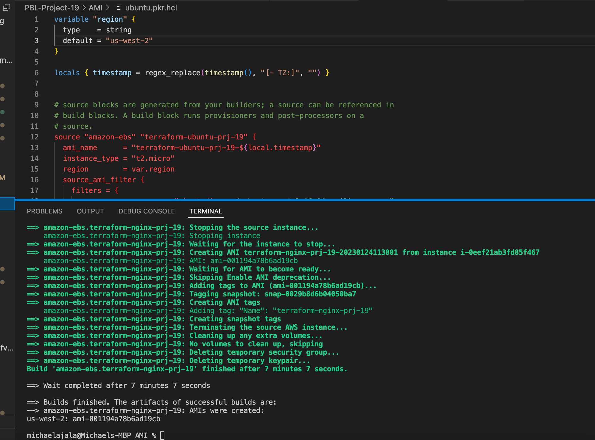
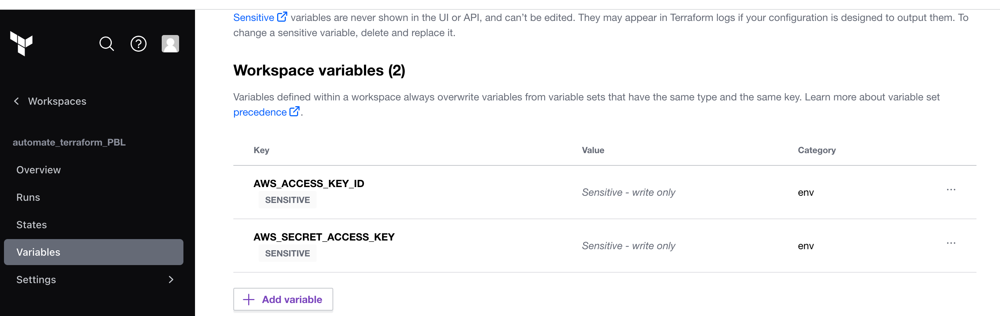

Automate Infrastructure With IaC using Terraform. Part 4 - Terraform Cloud.

This Project is the continuation of Project 18. In this project packer will be used to create the AMIs Needed, while Terraform will be used to create the infrastucture and Ansible to configure the infrastructure.

### Build Images using packer

- Installed Packer on my machine
```
brew tap hashicorp/tap 
```

```
brew install hashicorp/tap/packer
```

The Repository link below contains the AMI installation files

 https://github.com/Revelation69/packer-ami-pbl-19.git

 - Ran packer build for each of the files to create the AMIs



*the image above shows the succesful run of the packer build for ubuntu* 

- Hence, confirmed the AMIs  from my aws console.


- Updated the terraform script with the new AMIs created.


### Migrated the Terraform codes to Terraform Cloud

- Created a Terraform cloud account

- Created an organization

- Configured a WorkSpace [Used Version control workflow as this is the most common and recommended way to run Terraform commands triggered from git repository.]


- Configured Variables

Terraform Cloud supports two types of variables: environment variables and Terraform variables. Either type can be marked as sensitive, which prevents them from being displayed in the Terraform Cloud web UI and makes them write-only.

Set two environment variables: AWS_ACCESS_KEY_ID and AWS_SECRET_ACCESS_KEY, These credentials will be used to provision the AWS infrastructure by Terraform Cloud.




N.B The state files created are kept on the account unlike having it stored locally or backend.

- pushed my code to  my github repository to trigger a plan and apply on the terraform cloud account Ui.which was succesfull and  all the  resources were created.


- I SSH into the Bastion instance and cloned https://github.com/Revelation69/ansible-deploy-pbl-19.git  which contains Ansible scripts which was used to configure the infrastructure as required.

- To ensure the Ansible file can get all the required information from my AWS account such as the instance IP addresses, tags for each instances, ran aws configure and entered the required credentials.

- I made sure ssh-agent is enabled on the bastion instance, so that i can easily SSH into Nginx and Webservers.

- Updated the ansible script with values such as:

    - RDS endpoints for wordpress and tooling
    - Database name, password and username for wordpress and tooling
    - Access point ID for wordpress and tooling
    - Internal load balancer DNS for nginx reverse proxy

kindly refer  to theansible deploy  pbl repository  link above to access the full codes.

- I executed the code below to confirm that ansible is having access to all the resources 

```
ansible-inventory -i inventory/aws_ec2.yml --graph
```


- Then i executed the ansible playbook

```
ansible-playbook -i inventory/aws_ec2.yml playbooks/site.yml
```


- Ansible succesfully configured the  infastructure.

- Confirmed if  my target groups are healthy


*the image above shows that my target group are healthy, otherwise the websites won't be accessible. While the image below shows that the websites are working well.*


